A core challenge with scaling up Deep Reinforcement Learning (Deep RL) for use in robotic tasks of practical interest is the task specification problem, which typically manifests as the difficulty of reward design. In order to reduce the difficulty of reward function design in continuous robotics environments, we propose to develop a method that automatically densifies sparse, goal-based reward in robotic tasks such that the optimal policy is preserved by leveraging task plans. 

We hypothesize that for many robotic tasks, 
- while it is difficult for humans to specify a dense reward that cannot be hacked, it is easy to specify an abstract plannable model in PDDL that conveys information about the dynamics of the domain, and 
- that valid abstract plans within this model can be leveraged to automatically densify sparse reward via potential-based reward shaping sufficiently enough for state-of-the-art RL approaches to solve these tasks. 

We perform an extensive empirical evaluation of our system across different PDDL models with varying granularity, choices of potential function, choice of learning algorithm (PPO and SAC) and tasks.

#### [Report](assets/report.pdf) | [Presentation](https://docs.google.com/presentation/d/1M5sPGWkCsGoGVnfnY0i7reYVwLuUrs1Fx4Vm10iyals/edit?usp=sharing) | [Code](https://github.com/NishanthJKumar/airobot_reward_densification)

---

### Environments

#### Reaching - PPO 

<table class="wide">
    <colgroup>
        <col width="16.5%">
        <col width="16.5%">
        <col width="16.5%">
        <col width="16.5%">
        <col width="16.5%">
        <col width="16.5%">
    </colgroup>
    <tr>
        <td colspan="3">
            
 Sparse Handcrafted 

            

                
            

        </td>
        <td colspan="3">
            
 Dense Handcrafted 

            

                
            

        </td>
    </tr>
    <tr>
        <td colspan="2">
             
            
 Simple - Single Subgoal 

            

                
            

        </td>
        <td colspan="2">
             
            
 Simple - Multi Subgoal 

            

                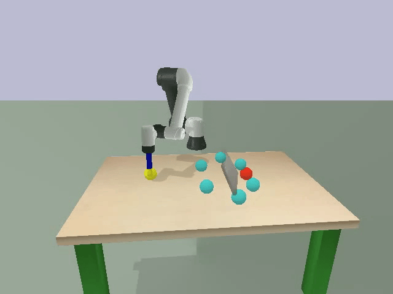
            

        </td>
        <td colspan="2">
             
            
 Simple - Grid Based 

            

                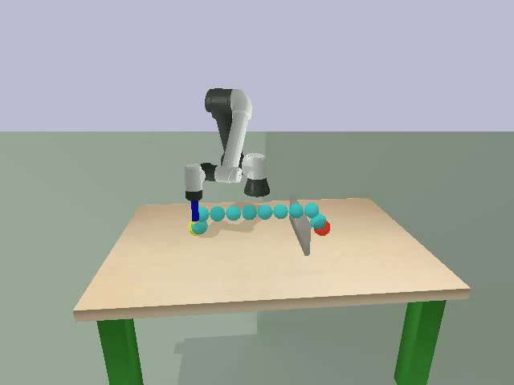
            

        </td>
    </tr>
    <tr>
        <td colspan="2">
             
            
 Plan-Based - Single Subgoal 

            

                
            

        </td>
        <td colspan="2">
             
            
 Plan-Based - Multi Subgoal 

            

                
            

        </td>
        <td colspan="2">
             
            
 Plan-Based - Grid Based 

            

                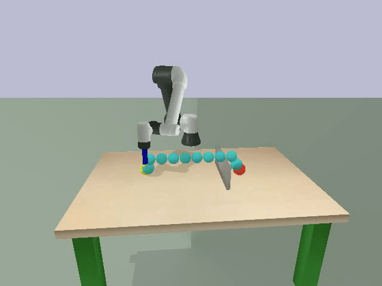
            

        </td>
    </tr>
    <tr>
        <td colspan="2">
             
            
 Distance-Based - Single Subgoal 

            

                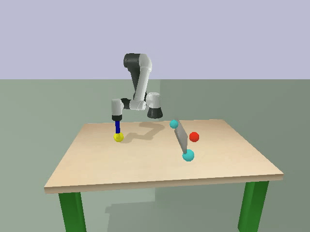
            

        </td>
        <td colspan="2">
             
            
 Distance-Based - Multi Subgoal 

            

                
            

        </td>
        <td colspan="2">
             
            
 Distance-Based - Grid Based 

            

                
            

        </td>
    </tr>
</table>

---

#### Reaching - SAC

<table class="wide">
    <colgroup>
        <col width="16.5%">
        <col width="16.5%">
        <col width="16.5%">
        <col width="16.5%">
        <col width="16.5%">
        <col width="16.5%">
    </colgroup>
    <tr>
        <td colspan="3">
            
 Sparse Handcrafted 

            

                
            

        </td>
        <td colspan="3">
            
 Dense Handcrafted 

            

                
            

        </td>
    </tr>
    <tr>
        <td colspan="2">
             
            
 Simple - Single Subgoal 

            

                
            

        </td>
        <td colspan="2">
             
            
 Simple - Multi Subgoal 

            

                
            

        </td>
        <td colspan="2">
             
            
 Simple - Grid Based 

            

                
            

        </td>
    </tr>
    <tr>
        <td colspan="2">
             
            
 Plan-Based - Single Subgoal 

            

                
            

        </td>
        <td colspan="2">
             
            
 Plan-Based - Multi Subgoal 

            

                
            

        </td>
        <td colspan="2">
             
            
 Plan-Based - Grid Based 

            

                
            

        </td>
    </tr>
    <tr>
        <td colspan="2">
             
            
 Distance-Based - Single Subgoal 

            

                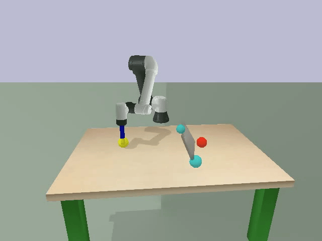
            

        </td>
        <td colspan="2">
             
            
 Distance-Based - Multi Subgoal 

            

                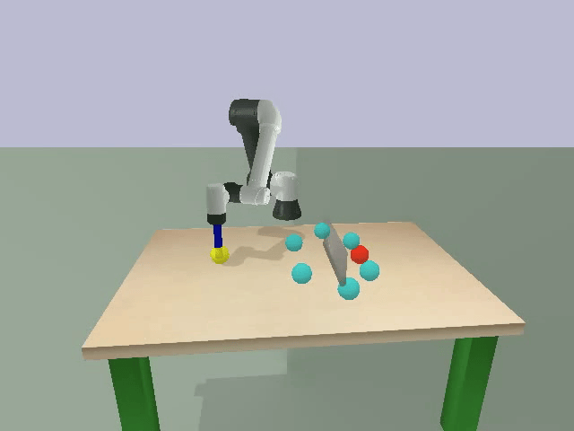
            

        </td>
        <td colspan="2">
             
            
 Distance-Based - Grid Based 

            

                
            

        </td>
    </tr>
</table>

---

#### Pushing - PPO

<table class="wide">
    <colgroup>
        <col width="16.5%">
        <col width="16.5%">
        <col width="16.5%">
        <col width="16.5%">
        <col width="16.5%">
        <col width="16.5%">
    </colgroup>
    <tr>
        <td colspan="3">
            
 Sparse Handcrafted 

            

                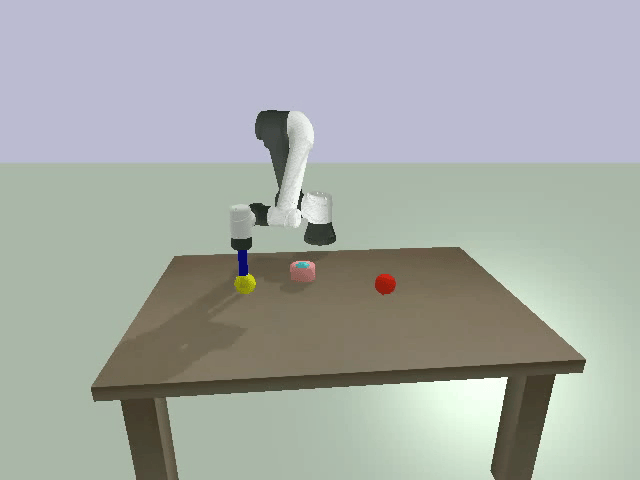
            

        </td>
        <td colspan="3">
            
 Dense Handcrafted 

            

                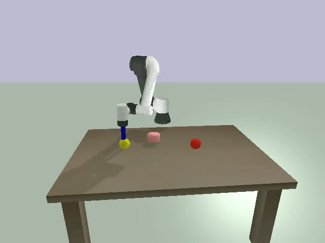
            

        </td>
    </tr>
    <tr>
        <td colspan="2">
             
            
 Simple - Single Subgoal 

            

                
            

        </td>
        <td colspan="2">
             
            
 Simple - Multi Subgoal 

            

                
            

        </td>
        <td colspan="2">
             
            
 Simple - Grid Based 

            

                
            

        </td>
    </tr>
    <tr>
        <td colspan="2">
             
            
 Plan-Based - Single Subgoal 

            

                
            

        </td>
        <td colspan="2">
             
            
 Plan-Based - Multi Subgoal 

            

                
            

        </td>
        <td colspan="2">
             
            
 Plan-Based - Grid Based 

            

                
            

        </td>
    </tr>
    <tr>
        <td colspan="2">
             
            
 Distance-Based - Single Subgoal 

            

                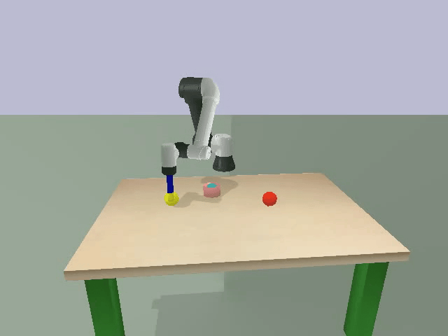
            

        </td>
        <td colspan="2">
             
            
 Distance-Based - Multi Subgoal 

            

                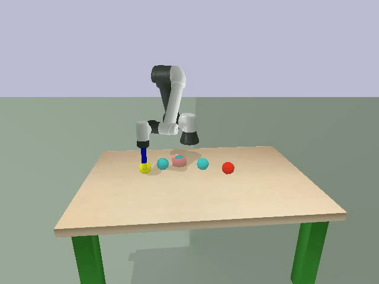
            

        </td>
        <td colspan="2">
             
            
 Distance-Based - Grid Based 

            

                
            

        </td>
    </tr>
</table>

---

##### Pushing - SAC

<table class="wide">
    <colgroup>
        <col width="16.5%">
        <col width="16.5%">
        <col width="16.5%">
        <col width="16.5%">
        <col width="16.5%">
        <col width="16.5%">
    </colgroup>
    <tr>
        <td colspan="3">
            
 Sparse Handcrafted 

            

                
            

        </td>
        <td colspan="3">
            
 Dense Handcrafted 

            

                
            

        </td>
    </tr>
    <tr>
        <td colspan="2">
             
            
 Simple - Single Subgoal 

            

                
            

        </td>
        <td colspan="2">
             
            
 Simple - Multi Subgoal 

            

                
            

        </td>
        <td colspan="2">
             
            
 Simple - Grid Based 

            

                
            

        </td>
    </tr>
    <tr>
        <td colspan="2">
             
            
 Plan-Based - Single Subgoal 

            

                
            

        </td>
        <td colspan="2">
             
            
 Plan-Based - Multi Subgoal 

            

                
            

        </td>
        <td colspan="2">
             
            
 Plan-Based - Grid Based 

            

                
            

        </td>
    </tr>
    <tr>
        <td colspan="2">
             
            
 Distance-Based - Single Subgoal 

            

                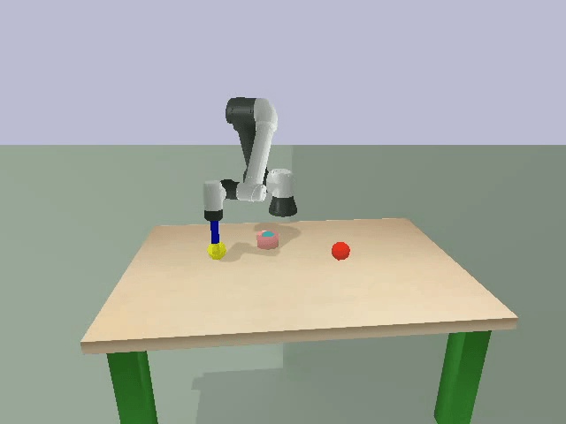
            

        </td>
        <td colspan="2">
             
            
 Distance-Based - Multi Subgoal 

            

                
            

        </td>
        <td colspan="2">
             
            
 Distance-Based - Grid Based 

            

                
            

        </td>
    </tr>
</table>

---

#### Maze-Reach - PPO

<table class="wide">
    <colgroup>
        <col width="16.5%">
        <col width="16.5%">
        <col width="16.5%">
        <col width="16.5%">
        <col width="16.5%">
        <col width="16.5%">
    </colgroup>
    <tr>
        <td colspan="6">
            
 Sparse Handcrafted 

            

                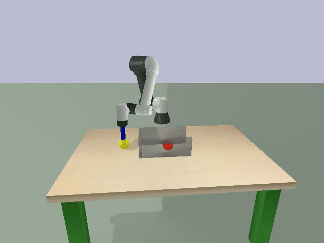
            

        </td>
    </tr>
    <tr>
        <td colspan="2">
             
            
 Distance-Based - Single Subgoal 

            

                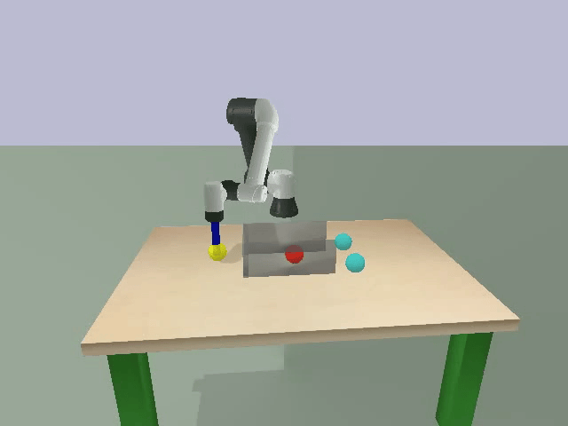
            

        </td>
        <td colspan="2">
             
            
 Distance-Based - Multi Subgoal 

            

                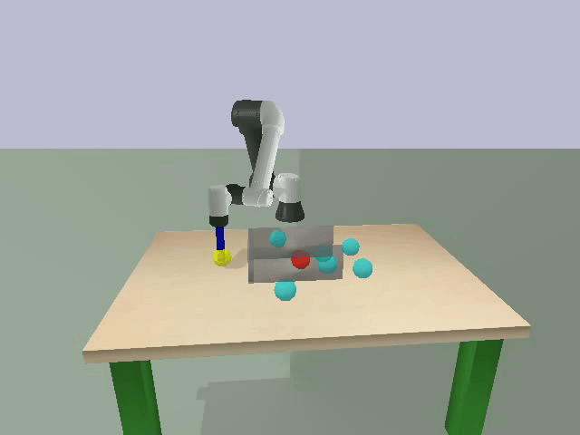
            

        </td>
        <td colspan="2">
             
            
 Distance-Based - Grid Based 

            

                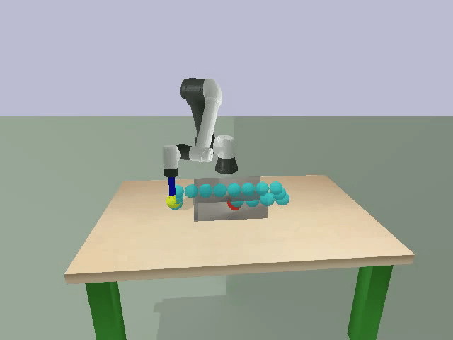
            

        </td>
    </tr>
</table>

---
